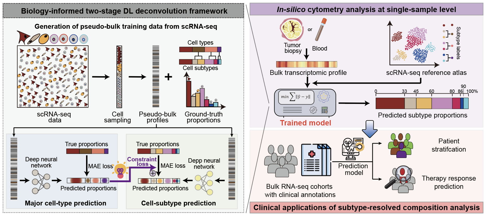

# scTumorDecon


## Overview

**scTumorDecon** is a biology-informed two-stage deep learning framework for subtype-level deconvolution of bulk RNA-seq data using scRNA-seq references. The framework integrates single-cell reference atlases, pseudo-bulk simulation, and biologically constrained deep neural networks(DNN) to estimate both major cellular compartments and fine-grained cellular subtypes from bulk transcriptomic samples.

The workflow is specifically designed for complex clinical samples, where low-abundance and highly correlated cell populations are difficult to resolve using conventional deconvolution approaches.

<p align="center">



</p>

Single-cell RNA-seq references are first used to generate pseudo-bulk samples with known cellular compositions. A two-stage hierarchical deep learning framework is then trained to predict major cell classes followed by cellular subtypes. The trained models can subsequently be applied to independent bulk RNA-seq cohorts for subtype-level deconvolution and downstream biological analyses.

scTumorDecon supports both CPU and GPU execution. GPU acceleration is recommended for large-scale pseudo-bulk simulation and model training.


## Installation

Clone the repository:

```bash
git clone https://github.com/Sara0201Tao/scTumorDecon.git
cd scTumorDecon
```

Install required packages:

```bash
pip install -r requirements.txt
```

Alternatively, install the package locally:

```bash
pip install -e .
```

scTumorDecon is implemented using PyTorch and supports both CPU and GPU execution.
For GPU acceleration, please install a CUDA-compatible PyTorch version following the official PyTorch instructions: https://pytorch.org/get-started/locally/


## Repository Structure

```text
scTumorDecon/
├── images/
│
├── scTumorDecon/
│   ├── __init__.py
│   ├── simulation.py
│   ├── utils.py
│   ├── model.py
│   ├── main.py
│   └── nestedCV_evaluation.py
│
├── LICENSE
├── pyproject.toml
├── requirements.txt
└── README.md
```

### Core modules

| File                   | Description                                                                                        |
| ---------------------- | -------------------------------------------------------------------------------------------------- |
| simulation.py          | Pseudo-bulk sample generation from scRNA-seq references                                            |
| utils.py               | Data processing and utility functions                                                              |
| model.py               | PyTorch neural network architectures and training procedures                                       |
| main.py                | Training and prediction workflow                                                                   |
| nestedCV_evaluation.py | Nested cross-validation, model evaluation, permutation testing, and confusion matrix visualization |


## Usage

### Input Data Requirements

#### 1. Single-cell RNA-seq expression matrix (`SCRNA_PATH`)

Tab-delimited text file (`.txt`).

* Rows: single cells
* Columns: genes
* First column: cell IDs
* First row: gene names
* Missing values are not allowed

The scRNA-seq reference matrix should contain library-size normalized expression values in each cell. In our analyses, the total expression of every cell sums to 10,000. Raw counts are not recommended as direct input.

Example:

| CellID | GeneA | GeneB | GeneC |
| ------ | ----- | ----- | ----- |
| Cell_1 | 0     | 8.1   | 1.5   |
| Cell_2 | 5.2   | 0     | 0.6   |


#### 2. Cell-type annotation file (`CELLTYPE_PATH`)

Tab-delimited text file (`.txt`).

* Rows must exactly match the order of cells in `SCRNA_PATH`
* First column: cell IDs
* Additional columns: major and minor cell-type annotations

Example:

| CellID | MajorType | MinorType |
| ------ | --------- | --------- |
| Cell_1 | Tcell     | CD8_cyto  |
| Cell_2 | Tcell     | CD4_Treg  |


#### 3. Pseudo-bulk training dataset (`TRAIN_FILE`)

Generated by `simulation.py`.

Format:

```text
train_data.h5ad
```

Contains:

* pseudo-bulk expression matrix
* major cell-type proportions
* subtype proportions
* hierarchy information


#### 4. Test dataset (`TEST_FILE`)

For simulation benchmarking:

```text
test_data.h5ad
```

For real bulk RNA-seq prediction:

```text
bulk_expression.txt
```

Tab-delimited expression matrix normalized by library-size and gene-length:

* Rows: genes
* Columns: samples

Example:

| Gene  | Sample1 | Sample2 |
| ----- | ------- | ------- |
| GeneA | 100     | 85      |
| GeneB | 42      | 56      |


### Step 1. Generate pseudo-bulk training data

Generate pseudo-bulk samples from annotated single-cell references.

```bash
python -m scTumorDecon.simulation \
    --scRNA-path ${SCRNA_PATH} \
    --cellType-path ${CELLTYPE_PATH} \
    --majorName MajorType \
    --minorName MinorType \
    --sampleNum 5000 \
    --cellNum 2000 \
    --outfile-path ${TRAIN_FILE}
```

Output:

```text
train_data.h5ad
```

### Step 2. Train scTumorDecon models

Train the two-stage deep learning framework using pseudo-bulk samples.

```bash
python -m scTumorDecon.main \
    --device cuda \
    --trainFile-path ${TRAIN_FILE} \
    --testFile-path ${TEST_FILE} \
    --majorGene-path ${MAJOR_MARKER_FILE} \
    --minorGene-path ${MINOR_MARKER_FILE} \
    --resultFile-path ${RESULT_DIR}
```

Output:

```text
*_minor_PredProps.csv
*_major_fromMinor_PredProps.csv
*_FinalScores_minor.csv
*_FinalScores_majorFromMinor.csv
*.log
```


### Step 3. Predict subtype compositions in real bulk RNA-seq samples

Apply trained models to independent bulk RNA-seq cohorts.

```bash
python -m scTumorDecon.main \
    --device cuda \
    --trainFile-path ${TRAIN_FILE} \
    --testFile-path ${BULK_EXP_FILE} \
    --majorGene-path ${MAJOR_MARKER_FILE} \
    --minorGene-path ${MINOR_MARKER_FILE} \
    --resultFile-path ${RESULT_DIR} \
    --realBulkData
```

Output:

```text
*_minor_PredProps.csv
*_major_fromMinor_PredProps.csv
*_major_direct_PredProps.csv
```


### Step 4. Evaluate downstream predictive models

The `nestedCV_evaluation.py` module can be used to evaluate downstream classification models based on scTumorDecon-derived cell proportions and optional functional/pathway features.

Input data should be provided as a single `.csv` table containing:

- one row per sample;
- one column for sample IDs, named `samples`;
- one label column, for example `Type` or `Group`;
- feature columns used for classification.

Example:

```python
import pandas as pd

from scTumorDecon.nestedCV_evaluation import run_svm_analysis

# Features used for classification
CELL_FEATURES = []
OTHER_FEATURES = []
FEATURES = CELL_FEATURES + OTHER_FEATURES

# Labels
LABEL_COL = "Type"
LABEL_ORDER = ["Good", "Bad"]

# Load data
df = pd.read_csv(FILE_PATH)
df["sample_id"] = df["samples"].astype(str)

# Run repeated nested-CV SVM evaluation
run_svm_analysis(
    df=df,
    feature_cols=FEATURES,
    label_col=LABEL_COL,
    order=LABEL_ORDER,
    output_dir=OUT_DIR,
    output_prefix="",
    analysis_name="",
    outer_repeats=5,
    n_permutations=1000,
    note=(),
)
```

The evaluation framework provides:

* Repeated nested cross-validation
* Parameter stability analysis
* Hyperparameter optimization
* Permutation testing
* Confusion matrix visualization


## Citation

If you use scTumorDecon in your research, please cite:

```text
xxxx
```
